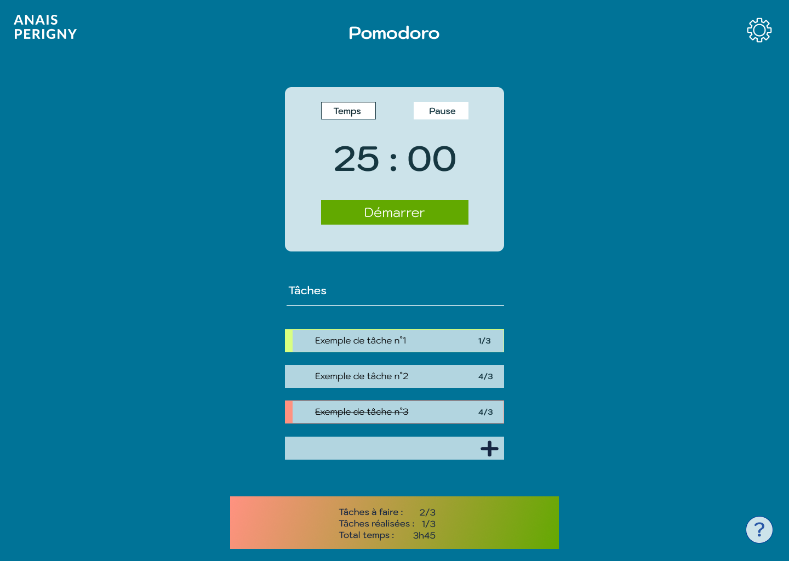

# Pomodoro
Projet personnel, je souhaite créer un pomodoro en Vanilla afin de mettre en application des points abordés en cours et me challenger.

## :beginner: Contexte
Je souhaite réaliser un Pomodoro depuis un moment et là je pense qu'il est temps que je me lance.
En m'inspirant du site : https://pomofocus.io/, j'ai créé ce projet.  
Il y aura une partie chronomètre avec :  
    - un minuteur qui fera un décompte de 25 minutes et un autre de 5 minutes pour le temps de pause,  
    - à la fin de chaque chrono une sonnera sera lancé et il faudra appuyer sur un bouton "stop" pour l'arrêter,  
    - un bouton start pour lancer le chronomètre, un bouton pour sa mise pause et un bouton d'accèlérateur (ou stop),  
Il y aura une partie pour la liste des tâches :  
    - chaque tâche aura un nom et un temps estimé,  
    - elles seront toutes enregistrées dans le LocalStrorage,  
    - on pourra sélectionner une tâche pour lancer le chronomètre,  
    - à la fin du chrono, il sera demandé à l'utilisateur si la tâche est terminé,  
    - on laisse la possibilité à l'utilisateur de réutiliser une tâche même si elle est terminé,  
    - donner la possibilité à l'utilisateur de supprimer une tâche ou toutes les tâches définitivement de la liste.  
Enfin il y aura un dernier bloc en bas de page qui comptabilisera le nombre de tâches à faire, le nombre de tâches terminées et le total de temps passés.  

## :art: Maquette
Après avoir listé toutes les actions que l'utilisateur pourra réaliser sur le site. J'ai réalisé une maquette sur figma 👍
